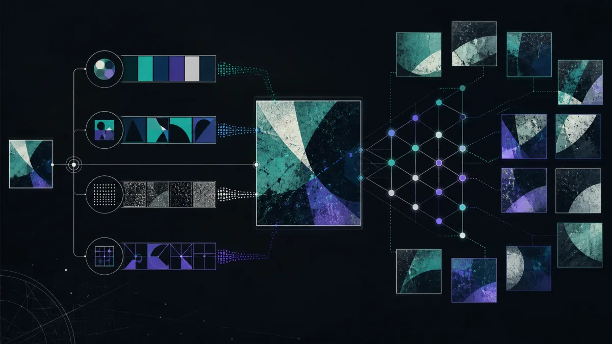

# Поиск по картинке: как проверить изображение и найти его источник

**Поиск по картинке** — это обратный поиск: вместо слов используется готовое изображение. Он помогает понять, где ещё опубликован снимок, найти более раннюю публикацию или проверить, не выдают ли чужую фотографию за собственную. Результат нужно воспринимать как подсказку для проверки, а не как доказательство личности или авторства.

Если удобнее начать с Telegram-инструмента Sherlock Bot для поиска по открытым данным, используйте [кнопку «Открыть в Telegram»](https://go.sherlockbot.is/?utm_source=github&utm_medium=repository&utm_campaign=poisk-po-kartinke).

*Визуальный поиск анализирует разные признаки картинки и формирует несколько групп возможных совпадений.*

## Что именно можно выяснить

Обратный поиск по изображению может привести к:

- страницам, где встречается тот же снимок или его изменённая копия;
- исходной публикации, подписи, дате или контексту, если они доступны публично;
- версии картинки в большем размере;
- признакам повторного использования фотографии в объявлении или профиле.

Совпадение изображения не доказывает, что найденная страница принадлежит человеку на фото. Кадр мог быть стоковым, старым, обрезанным, отредактированным или опубликованным без согласия автора.

## Как сделать поиск по картинке

### 1. Подготовьте подходящий файл

Выберите чёткое изображение без лишних элементов интерфейса. Если на нём несколько объектов, сделайте отдельные кадры или обрезки: так проще понять, что именно совпало. Не загружайте чужие документы, интимные материалы и фотографии людей без законного основания.

### 2. Передайте изображение в инструмент

Откройте [«Открыть в Telegram»](https://go.sherlockbot.is/?utm_source=github&utm_medium=repository&utm_campaign=poisk-po-kartinke) и отправьте изображение по инструкции интерфейса. Для качественного результата не ухудшайте файл повторным скриншотом и не добавляйте к нему лишние надписи.

### 3. Разберите найденные совпадения

Смотрите не только на миниатюру, но и на адрес страницы, дату публикации, подпись и окружающий текст. Несколько похожих картинок могут быть вариациями одного исходника, а не независимыми подтверждениями.

### 4. Проверьте вывод по первоисточнику

Откройте найденную публичную страницу самостоятельно и сравните детали: кадрирование, фон, водяные знаки, одежду, последовательность публикаций и дату. Для решения о покупке, жалобе или обвинении сохраните ссылку на первоисточник и перепроверьте факт другим независимым способом.

## Ограничения метода

Поиск по картинке не видит весь интернет и не гарантирует совпадение. Результат зависит от качества файла, степени изменения изображения, настроек индексации страниц и того, опубликована ли картинка открыто. Закрытые профили, удалённые страницы и непроиндексированные материалы могут не появиться.

Не стоит делать вывод о человеке только по фотографии, имени аккаунта или одному совпадению. Не используйте найденные данные для преследования, шантажа, мошенничества, публикации личной информации или обхода настроек приватности.

## Безопасная проверка перед действием

Перед тем как доверять объявлению или собеседнику, задайте себе три вопроса:

1. Есть ли у найденной публикации понятная дата и контекст?
2. Совпадает ли автор первоисточника с тем, кто прислал изображение?
3. Есть ли независимое подтверждение — официальный сайт, другой канал связи или документы, проверенные отдельно?

Если изображение связано с деньгами, угрозой или спором об авторстве, не передавайте коды, не переводите средства и не публикуйте персональные данные до дополнительной проверки.

## Частые вопросы

### Можно ли найти оригинал фотографии?

Иногда да: поиск показывает публичные страницы с тем же или похожим изображением. Самая ранняя найденная ссылка не всегда является настоящим оригиналом, поэтому проверяйте даты, автора и историю публикаций.

### Найдёт ли поиск человека по фотографии?

Он может обнаружить открытые страницы, где размещён похожий снимок, но не подтверждает личность человека. Использовать такие результаты для установления личности, слежки или давления нельзя.

### Почему одинаковые изображения не находятся?

Причинами могут быть низкое качество, сильная обрезка или обработка, закрытая страница, удалённая публикация либо отсутствие страницы в доступных источниках. Попробуйте исходный файл и отдельную обрезку ключевого объекта, но воспринимайте отсутствие результата как отсутствие найденного совпадения, а не как доказательство уникальности.

### Безопасно ли загружать личную фотографию?

Оценивайте необходимость загрузки и не отправляйте чувствительные изображения без согласия владельца. Удалите из файла лишние данные, не используйте фотографии несовершеннолетних и ознакомьтесь с правилами инструмента перед передачей материала.

### Можно ли использовать результат как доказательство?

Один результат обратного поиска — только ориентир. Для жалобы, спора или сделки нужны сохранённые первоисточники, даты, контекст и независимая проверка; при необходимости обратитесь к юристу или в компетентную службу.

## Итог

Поиск по картинке полезен как первый этап проверки происхождения изображения. Сопоставляйте найденные страницы с первоисточником, учитывайте ограничения индексации и уважайте право на приватность.

Чтобы отправить изображение в Telegram-инструмент, нажмите [«Открыть в Telegram»](https://go.sherlockbot.is/?utm_source=github&utm_medium=repository&utm_campaign=poisk-po-kartinke).

## Дополнительно

- [FAQ: поиск по картинке](FAQ.md)
- [Правила законного и безопасного использования](SECURITY.md)

